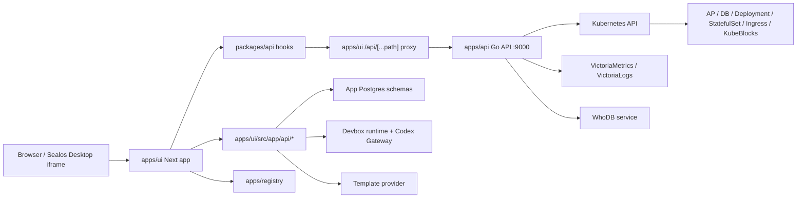
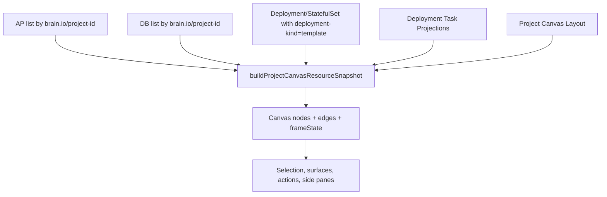
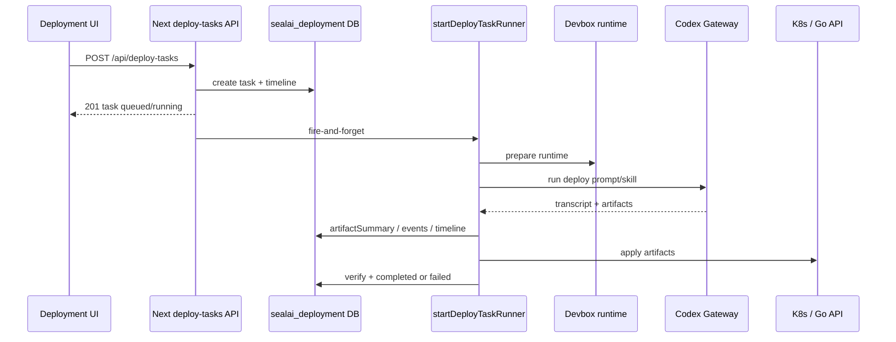

# Brain 代码心智模型

更新时间: 2026-06-23

这份文档的目标不是替代 README, 而是给接手当前代码的人一个可执行的阅读地图: 先知道系统边界, 再知道关键状态从哪里来, 最后知道排障时该查哪一层证据。

## 0. 先记住的结论

Brain 当前不是一个单纯的 Next.js 前端。它是一个 Turbo monorepo, 由以下几层组成:

- `apps/ui`: 主产品 UI, 同时也是 Next API, Drizzle 数据层和 Deployment Task runner 的所在地。
- `apps/api`: Go + chi + Huma 的 Sealos/Kubernetes 产品 API, 负责 AP/DB/K8s/logs/metrics/telemetry 等资源读写。
- `apps/registry`: 组件预览/registry app, 服务于设计系统和 shadcn 风格组件目录。
- `apps/whodb`: 集成的 WhoDB 后端, 给 DB browser 能力提供 GraphQL/runtime 支撑。
- `packages/ui`: 共享 UI primitives, canvas/node/side-pane/log-viewer 等组件, 不应该承载完整产品 workflow。
- `packages/api`: 浏览器侧 API contract 和 SWR hooks, 主要封装 Go API 路径、kubeconfig auth header 和 fetcher。

最重要的业务轴是 Project 和 Deployment Task:

- Project 是产品空间, 按 namespace + Brain project id 组织。
- Project Canvas 是 Project 的读模型, 由 AP, DB, template-native workloads, deployment projections, layout document 合成。
- Deployment Task 是所有部署入口的生命周期模型, 不属于 Chat, 也不只是 GitHub deploy。
- AP/DB 是 Brain 产品资源, direct AP/DB 会先生成 `brain.io/direct` 产品 manifest, 再由 Go API 渲染为原生 Kubernetes/KubeBlocks 资源。
- Template deployment 走独立 renderer/apply 路径, 但 Brain 侧必须强制注入 deployment-scoped labels。

## 1. 仓库形状

根目录事实:

- 包管理器: `bun@1.3.5`, 见 `package.json`。
- monorepo 编排: Turbo, 见 `turbo.json`。
- Node 要求: `>=20`。
- 当前 Next/React: `apps/ui/package.json` 使用 Next `16.2.6`, React `19.2.6`。
- 当前 Go API: `apps/api`, 默认端口 `9000`, 见 `apps/api/main.go`。

常用命令:

```fish
bun dev
bun dev:all
bun build
bun typecheck
bun check
cd apps/api; go test ./...
cd apps/registry; bun run registry:build
```

当前仓库有 `.codegraph/`, 做代码定位时优先用:

```fish
codegraph explore "Deployment Task end-to-end flow"
codegraph node apps/ui/src/lib/deploy-task/runner.ts
```

## 2. 高层架构图



读代码时最容易混淆的是两套 API:

- `apps/ui/src/app/api/*`: Next API, 处理 deploy task、chat、GitHub OAuth、template catalog、project persistence、canvas layout 等 app-owned 逻辑。
- `apps/api/route/*`: Go API, 处理 Kubernetes 和 Brain AP/DB 产品资源。

浏览器里大多数 `@workspace/api` hooks 通过 same-origin `/api/...` 调用, 再由 `apps/ui/src/app/api/[...path]/route.ts` 代理到 `process.env.API_URL` 指向的 Go API。

## 3. 关键项目文档和决策

先读这些:

- `CONTEXT.md`: ubiquitous language, 定义 Project, AP, DB, Deployment Task, timeline, projection, canvas 等产品语义。
- `docs/adr/0023-model-all-deployments-as-deployment-tasks.md`: 所有部署入口都应该创建 Deployment Task。
- `docs/adr/0025-stream-project-deployment-task-projections.md`: Project Canvas 读 deployment projections 的方式是 bootstrap + project-scoped stream。
- `docs/adr/0027-use-deployment-scope-brain-labels.md`: Brain ownership label contract。
- `docs/adr/0028-model-deployment-progress-as-task-owned-timelines.md`: 进度属于 task-owned timeline。
- `docs/adr/0020-keep-shared-ui-free-of-product-workflows.md`: `packages/ui` 不能变成第二个产品 app 层。
- `docs/deployment/brain-system.md`: Helm 部署 runbook。

这些 ADR 是当前代码的解释框架。遇到部署、canvas、labels、timeline 问题时, 先用 ADR 判断边界, 再查实现。

## 4. App 与 package 边界

### apps/ui

主产品 UI 和 app server 逻辑。

重要入口:

- `apps/ui/src/app/layout.tsx`: 全局 providers, 包括 Jotai, nuqs, ThemeProvider, TooltipProvider, Toaster。
- `apps/ui/src/app/page.tsx`: 重定向到 `/project`。
- `apps/ui/src/app/project/layout.tsx`: project shell, auth bootstrap, Sealos SDK hydrate, sidebar, workspace layout。
- `apps/ui/src/app/project/page.tsx`: project list, project creation side pane。
- `apps/ui/src/app/project/[uid]/page.tsx`: Project Canvas 主页面。

重要 feature:

- `apps/ui/src/features/project-creation`: 创建 Project 和选择部署入口。
- `apps/ui/src/features/deployment`: Docker, DB, GitHub, Template 部署 UI。
- `apps/ui/src/features/deployment-target/pipeline.ts`: 把各部署 UI 入口收敛成 Deployment Task create input。
- `apps/ui/src/features/project-canvas`: canvas 读模型、布局、节点、side panes、workbench、telemetry。
- `apps/ui/src/features/project-settings`: AP/DB settings draft 和提交逻辑。
- `apps/ui/src/features/data-browser`: DB browser, backup/restore/access workflow。
- `apps/ui/src/features/project-assistant`: chat shell 和 product tools。

重要 server lib:

- `apps/ui/src/lib/deploy-task/*`: task schema, service, runner, timeline, projection, artifacts, readiness。
- `apps/ui/src/lib/project-persistence/*`: projects, canvas layout, navigation preferences。
- `apps/ui/src/lib/chat-persistence/*`: assistant chat, messages, GitHub connection。
- `apps/ui/src/lib/template-renderer.ts`: Brain 本地 template rendering 和 label normalization。
- `apps/ui/src/lib/template-k8s-apply.ts`: template apply 和 GHCR pull secret handling。
- `apps/ui/src/lib/docker-deployment-yaml.ts`: Docker deploy -> direct AP manifest。
- `apps/ui/src/lib/db-deployment-yaml.ts`: DB deploy -> direct DB manifest。
- `apps/ui/src/lib/brain-labels.ts`: TS 侧 Brain label constants。

### apps/api

Go API, 负责 Brain product API 和 Kubernetes access。

入口:

- `apps/api/main.go`: chi mux, Huma OpenAPI, `/health`, `/docs`, route registration, 默认 `:9000`。

路由:

- `apps/api/route/ap`: `/api/ap/v1alpha1`, AP list/get/create/update/delete/restart/events/env-value/versions。
- `apps/api/route/db`: `/api/db/v1alpha1`, DB list/get/create/update/delete/backup/restore/start/stop/restart/access。
- `apps/api/route/k8s`: `/api/k8s/v1alpha1`, get/describe/logs/top/apply/delete/patch/scale/autoscale/rollout/exec。
- `apps/api/route/logs`, `apps/api/route/metrics`, `apps/api/route/telemetry`: logs 和 metrics 查询面。
- `apps/api/route/auth`: region token -> kubeconfig。

服务层:

- `apps/api/service/orchestration/ap.go`: AP product manifest -> Deployment/StatefulSet/Service/HPA/ConfigMap/Secret。
- `apps/api/service/orchestration/db.go`: DB product manifest -> KubeBlocks Cluster, export Service, OpsRequest。
- `apps/api/service/orchestration/labels.go`: Go 侧 Brain labels。
- `apps/api/service/transform/ap/get.go`: 原生资源 -> AP product view。
- `apps/api/service/transform/db/get.go`: 原生资源 -> DB product view。
- `apps/api/service/k8s/*`: dynamic client apply/get/logs/exec/rollout/scale 等。
- `apps/api/service/workloadtelemetry/*`: metrics snapshot/series。
- `apps/api/service/logs/*`: VictoriaLogs 查询。
- `apps/api/service/db/*`: DB access, backup, restore, WhoDB integration。

### packages/api

浏览器 API contract 层。

- `packages/api/src/constants.ts`: Go API 路径常量, 包含 k8s/ap/db/telemetry/auth。
- `packages/api/src/fetch.ts`: 最小 fetcher, 拼 URL, query, JSON body, 错误。
- `packages/api/src/hooks/*`: SWR hooks, 包括 AP/DB list, lifecycle, logs, metrics, telemetry, product resource。
- `packages/api/src/credential-key.ts`: kubeconfig bearer header 和 SWR credential key。

核心心智模型: UI feature 不直接手写 Go API path, 优先通过 `@workspace/api` 的 constants/hooks。

### packages/ui

共享 UI 和组件系统。

- `packages/ui/src/components/*`: shadcn/Radix-style primitives 和产品可复用 visual components。
- `packages/ui/src/components/canvas/*`: Canvas shell。
- `packages/ui/src/components/*-node/*`: canvas node visuals。
- `packages/ui/src/components/ai-elements/*`: chat/task 等 AI display elements。
- `packages/ui/src/styles/globals.css`: Tailwind v4 tokens。

边界: `packages/ui` 可以有 host-driven 组件, 但不应该拥有 project creation、deployment flows、settings lifecycle、data loading、route state。

## 5. Auth 和 kubeconfig 模型

浏览器侧状态在:

- `apps/ui/src/store/auth-store.tsx`

核心 atom:

- `kubeconfigAtom`
- `namespaceAtom`
- `desktopLanguageAtom`

初始化路径:

- `apps/ui/src/app/project/layout.tsx` 挂 `AuthBootstrap` 和 `SealosSdkBootstrap`。
- `AuthBootstrap` 支持 `NEXT_PUBLIC_DEV_ENCODED_KUBECONFIG` 本地覆盖。
- `SealosSdkBootstrap` 用 `@labring/sealos-desktop-sdk` 获取 session kubeconfig 和 language。
- namespace 由 kubeconfig current context 推导, 见 `namespaceFromKubeconfigText`。

排障提醒:

- 本地 dev 的 `NEXT_PUBLIC_DEV_ENCODED_KUBECONFIG` 会覆盖 iframe/session 传入值。
- task DB 和 cluster evidence 要先确认 namespace 和当前 Brain 实例, 不要把本地 dev DB 当成 staging/cluster DB。
- 所有 K8s/Go API 调用基本都依赖 kubeconfig bearer header。

## 5.1 Project creation 心智模型

Project creation 是部署入口的主交互层, 但它本身不直接 apply 资源。

关键文件:

- `apps/ui/src/app/project/page.tsx`: Project list 页面, 打开 creation side pane。
- `apps/ui/src/features/project-creation/project-creation-pane.tsx`: side pane chrome 和 entry mode 分发。
- `apps/ui/src/features/project-creation/use-project-creator.ts`: 集成 GitHub auth, repo list, template catalog, confirm actions。
- `apps/ui/src/features/project-creation/creator/*`: 多步创建 UI。
- `apps/ui/src/features/deployment-target/client-adapters.ts`: 浏览器侧 create deployment task adapter。
- `apps/ui/src/features/deployment-target/pipeline.ts`: Project creation 最终都走这里。

entry mode:

- `general`: ProjectCreator 多入口选择。
- `githubDirect`: 只显示 GitHubDeployer。
- `dockerDirect`: 直接进入 Docker stage。
- `databaseDirect`: 直接进入 Database stage。
- `templateDirect`: 直接进入 Template stage。

确认动作统一模型:

1. derive display name, 例如 Docker/GitHub/DB 会根据 source 推导 project name 并避免重名。
2. `runDeploymentTargetPipeline(...)` 生成 `source/target/runner`。
3. `createDeploymentTask(...)` 调 Next deploy-task API。
4. 成功后 `dispatchDeployTaskCreatedEvent({ projectId, taskId })`。
5. 关闭 creation pane。
6. `onProjectCreated(projectId)` 刷新 project list 并跳转 `/project/<projectId>`。

GitHub 有一个额外分支:

- 普通 GitHub import 走 AI runner。
- 如果 `findTemplateForGithubRepo(...)` 命中 template 且 `templateCanDeployWithDefaults(...)`, 可以走 template deploy, 不是 AI runner。

## 6. Deployment Task 心智模型

### 6.1 数据模型

核心定义:

- `apps/ui/src/lib/deploy-task/schema.ts`

Deployment Task 存在 `sealai_deployment` schema:

- `deploy_tasks`
- `deploy_task_events`
- `deploy_task_messages`

Task status:

```text
queued | running | blocked | applying | completed | failed | cancelled
```

Task phase:

```text
queued | resolve-target | prepare | plan | configure | generate-artifacts | apply | verify | completed
```

Task 的三大结构:

- `source`: database, docker, github, prompt, template。
- `target`: newProject 或 existingProject。
- `runner`: direct, template, ai。

其他关键字段:

- `artifactSummary`: build result, delivery manifest, deployment plan, resource yamls, applied resources。
- `canvasProjection`: Project Canvas placeholder/projection 所需信息。
- `timelineSnapshot`: task-owned timeline 当前快照。
- `blockingInputs`: 缺少 env/secret/confirmation 时的输入门。
- `gatewayStateSnapshot` 和 `failureDetails`: 结构化调试证据。

schema bootstrap:

- `apps/ui/src/lib/deploy-task/schema-bootstrap.ts`

它会创建/迁移 deploy task tables, 也承担旧 GitHub-only task shape 到 source/target/runner 模型的迁移。

### 6.2 创建和启动

入口:

- `apps/ui/src/app/api/deploy-tasks/route.ts`

POST 行为:

1. 校验 request body。
2. 解析 namespace, 支持 encoded kubeconfig。
3. `createDeployTask(...)` 写入 DB, 初始 timeline。
4. `resolveDeploymentTaskTarget(...)` 预解析 project target。
5. fire-and-forget 调 `startDeployTaskRunner(...)`。
6. HTTP 201 返回 task 信息。

重要结论: POST 201 只代表 task 已创建并启动 runner, 不代表部署完成。

### 6.3 部署入口如何映射到 runner

核心文件:

- `apps/ui/src/features/deployment-target/pipeline.ts`

映射关系:

| UI 入口 | source.kind | runner.kind | 说明 |
| --- | --- | --- | --- |
| Docker image | `docker` | `direct` | 结构化 AP 创建 |
| Database | `database` | `direct` | 结构化 DB 创建 |
| Template | `template` | `template` | Sealos template/native renderer |
| GitHub repo | `github` | `ai` | Devbox runtime + Codex Gateway + `sealos-deploy` skill |
| Prompt | `prompt` | `ai` | AI runner |

### 6.4 Runner 主入口

核心文件:

- `apps/ui/src/lib/deploy-task/runner.ts`

主函数:

- `startDeployTaskRunner(input)`

关键逻辑:

- 读取 task。
- `requireKubeconfig(input)`。
- `resolveDeploymentTaskTarget(task)`。
- 如果是 AI runner 且用户提交了 blocking input, 从已有 outputJson 继续 apply。
- runner.kind 分发:
  - `direct`: `runDirectDeploymentTask`
  - `template`: `runTemplateDeploymentTask`
  - `ai`: `runAiDeploymentTask`
- catch 分支会:
  - `markDeployTaskFailureTimeline(...)`
  - `updateDeployTaskState(... status: failed, error, failureDetails ...)`
  - 记录 `deployment_task.failed` event。

### 6.5 Timeline

理念:

- timeline 属于 Deployment Task, 不是浏览器局部状态, 不是 Chat transcript。

关键文件:

- `apps/ui/src/lib/deploy-task/timeline.ts`
- `apps/ui/src/lib/deploy-task/timeline-storage.ts`
- `apps/ui/src/lib/deploy-task/timeline-events.ts`
- `apps/ui/src/lib/deploy-task/use-deployment-task-timeline.ts`
- `apps/ui/src/features/deployment/deployment-task-timeline-pane.tsx`

客户端 hook 模型:

1. `fetchDeploymentTaskTimeline(...)` 拉当前快照。
2. `streamDeploymentTaskTimeline(...)` 接 SSE。
3. 断线后 1500ms 重连。
4. 每次 event 用 `applyDeploymentTaskTimelineSnapshot` 合并。

对应 API:

- `GET /api/deploy-tasks/[taskId]/timeline`
- `GET /api/deploy-tasks/[taskId]/events`

### 6.6 Blocking input 和 resume

入口:

- `apps/ui/src/app/api/deploy-tasks/[taskId]/input/route.ts`

行为:

1. 校验 submitted values。
2. 确认 task 属于 namespace。
3. `submitDeployTaskInput(taskId, { values })`。
4. 再次调用 `startDeployTaskRunner(...)`, 传入 `submittedInputValues`。

这解释了为什么任务可以先 `blocked`, 用户填完配置后继续跑。

### 6.7 Projection 和 Canvas handoff

ADR 0025 定义: Canvas 不应该高频轮询 full task list, 而是 Project-level projections。

关键文件:

- `apps/ui/src/lib/deploy-task/projection.ts`
- `apps/ui/src/lib/deploy-task/projection-events.ts`
- `apps/ui/src/app/api/deploy-task-projections/stream/route.ts`
- `apps/ui/src/features/project-canvas/snapshot/use-project-canvas-resource-snapshot.ts`
- `apps/ui/src/features/project-canvas/snapshot/deployment-placeholder-nodes.ts`
- `apps/ui/src/features/project-canvas/workbench/deployment-task-timeline-reentry.ts`

Project Canvas 启动时:

1. `fetchProjectDeploymentTaskProjections(...)` 拉当前 project 的 projections。
2. `streamProjectDeploymentTaskProjections(...)` 接 SSE。
3. 收到 snapshot/upsert/remove 后触发 workload reconciliation。
4. deployment placeholders 和 dock 都来自 projection, 不是直接来自 raw task row。

## 7. Project Canvas 心智模型

主入口:

- `apps/ui/src/app/project/[uid]/page.tsx`

核心 hook:

- `apps/ui/src/features/project-canvas/workbench/use-project-canvas-module.ts`
- `apps/ui/src/features/project-canvas/snapshot/use-project-canvas-resource-snapshot.ts`
- `apps/ui/src/features/project-canvas/workbench/use-project-canvas.ts`

Canvas 状态由多源合成:



数据源:

- AP list: `useApsK8sList` -> Go AP API。
- DB list: `useDbsK8sList` -> Go DB API。
- Template native workloads: `useTemplateNativeWorkloads` -> K8s get deployments/statefulsets with template labels。
- Deployment projections: Next API + SSE。
- Layout: `project_canvas_layouts` table。

刷新模型:

- 初始 discovery 有 8s fast poll window。
- reconcile poll window 为 60s。
- Project-level projection stream 断线 3000ms 重连。
- 页面重新 visible 时会 revalidate。
- Canvas 对空图有 sticky loading, 避免 SWR 短周期闪烁。

布局模型:

- `project_canvas_layouts` 以 namespace + project id 存 layout nodes 和 version。
- Deployment placeholder 的 placement owner 与最终 resource placement owner 不同。
- handoff 时可以把 projection placement rekey 到结果资源。
- missing resource layout 有 grace period, 避免短暂资源不可见就删布局。

Surface 模型:

- `useProjectCanvas` 组合 route state、selection、resource actions、settings leave guard、side/main/drawer surfaces。
- side pane 可能是 AP/DB settings, logs, metrics, terminal, deployment timeline 等。
- deployment timeline close 会记录手动关闭 task id, 避免自动反复打开。

## 8. AP/DB direct deployment 心智模型

### 8.1 Docker -> AP

UI:

- `apps/ui/src/features/deployment/docker-deployer.tsx`
- `apps/ui/src/features/deployment/docker-deployment-settings.ts`

YAML:

- `apps/ui/src/lib/docker-deployment-yaml.ts`

行为:

- 用户输入 image/env/command/args/configMaps/storage/appListeningPort。
- settings validation 检查 image、port、env name、mount path、storage size。
- 渲染 `apiVersion: brain.io/direct`, `kind: AP`。
- `spec.input` 包含 image、network.appListeningPorts、platformAddresses、env、command、args、configMaps、storage。
- 有 storage 时 workload kind 变成 statefulset。

Go 渲染:

- `apps/api/service/orchestration/ap.go`

输出:

- Deployment 或 StatefulSet。
- Service。
- 可选 HPA。
- 可选 ConfigMap。
- 可选 imagePullSecret。
- public routing support resources 由 AP route/update/apply 相关逻辑处理。

### 8.2 Database -> DB

UI:

- `apps/ui/src/features/deployment/database-deployer.tsx`

YAML:

- `apps/ui/src/lib/db-deployment-yaml.ts`

行为:

- 用户选择 engine, quota preset, replicas。
- 渲染 `apiVersion: brain.io/direct`, `kind: DB`。
- spec 包含 engine、quota、replicas、projectId、exposeNodePort 等。

Go 渲染:

- `apps/api/service/orchestration/db.go`

输出:

- KubeBlocks Cluster。
- 可选 export Service。
- start/stop/restart/update/backup/restore 等通过 DB routes 和 service 层转成 KubeBlocks 操作。

## 9. Template deployment 心智模型

关键文件:

- `apps/ui/src/features/deployment/template-deployer.tsx`
- `apps/ui/src/lib/template-provider-core.ts`
- `apps/ui/src/lib/template-renderer.ts`
- `apps/ui/src/lib/template-k8s-apply.ts`
- `apps/ui/src/app/api/templates/route.ts`
- `apps/ui/src/app/api/templates/deploy/route.ts`

Template catalog:

- 来自 `TEMPLATE_PROVIDER_URL`。
- legacy provider response 会被转成 `TemplateCatalogItem`。
- template inputs/defaults 是 deploy form 和 blocking input 的来源。

Rendering:

- `renderTemplateDeployment(...)` 会:
  - 校验 instanceName 是 DNS name。
  - flatten defaults。
  - resolve inputs。
  - 如果 appYaml 没有 Instance, 自动补 Instance。
  - render template string。
  - parse resources。
  - 给所有资源应用 Brain labels。
  - 返回 instanceYaml, dependentYamls, resources。

Apply:

- `applyRenderedTemplateDeployment(...)` 通过 Go K8s apply API apply YAML。
- apply 前会 normalize rendered resources 的 Brain labels。
- StatefulSet/Deployment pod template 和 volumeClaimTemplates 也会补 Brain labels。
- GHCR image 支持 pull secret 注入, 避免 GitHub private package 拉取失败。

重要边界:

- Template provider 不能被信任为 Brain label contract 的唯一来源。
- Brain 自己的 render/apply path 必须强制补 labels。
- Template deployment 的产品分类不靠 `brain.io/resource-kind`, 而靠 deployment scope 内的 Kubernetes kind 和关系推导。

## 10. GitHub / AI deploy 心智模型

UI:

- `apps/ui/src/features/deployment/github-deployer/*`
- `apps/ui/src/hooks/use-github-auth.ts`

GitHub App/token:

- `apps/ui/src/lib/github-app/*`
- GitHub connection 存在 `sealai_assistant.github_connections`。
- DB 保存 namespace 级 GitHub App installation 元数据。
- runner 按 `githubConnectionId + namespace` 服务端临时 mint installation token。

Task runner:

- GitHub deploy 在 `deployment-target/pipeline.ts` 中映射为:
  - `source.kind = github`
  - `runner.kind = ai`
  - `runtimeProvider = devbox`
  - `skill = sealos-deploy`

AI runner 高层链路:



Artifact contract:

- `.sealos/build-result.json`
- `.sealos/delivery-manifest.json`
- `.sealos/template/index.yaml`

注意:

- `output_ready` 只代表产物齐了, 不代表 task completed。
- 缺 required inputs 时 task 可能进入 `blocked`。
- 最终成功要看 task status, timeline result cards, K8s readiness。

## 11. 数据库 schema 心智模型

Drizzle config:

- `apps/ui/drizzle.config.ts`

它只管理 app-owned schemas, 防止对 managed Postgres 的 `public`/extension objects 做破坏性 reconcile。

### sealai_project

文件:

- `apps/ui/src/lib/project-persistence/schema.ts`

表:

- `projects`: namespace + id 为主键, displayName, description。
- `project_canvas_layouts`: namespace + project id 为主键, version, layout nodes。
- `project_navigation_preferences`: namespace 维度 pinned project ids。
- `ap_image_versions`: AP image version history。

### sealai_deployment

文件:

- `apps/ui/src/lib/deploy-task/schema.ts`
- `apps/ui/src/lib/deploy-task/schema-bootstrap.ts`

表:

- `deploy_tasks`
- `deploy_task_events`
- `deploy_task_messages`

这是 deployment domain 的 source of truth。

### sealai_assistant

文件:

- `apps/ui/src/lib/chat-persistence/schema.ts`

表:

- `assistant_chats`
- `assistant_chat_messages`
- `assistant_entitlements`
- `github_connections`

Chat 可以创建/查询/解释 Deployment Task, 但 Deployment Task 生命周期不属于 chat schema。

## 12. Label contract 心智模型

当前 canonical contract:

```text
brain.io/managed-by=brain
brain.io/project-id=<projectId>
brain.io/deployment-kind=<ap | db | template>
brain.io/deployment-name=<apName | dbName | templateInstanceName>
```

Template 额外:

```text
brain.io/template-name=<templateName>
```

代码位置:

- TS: `apps/ui/src/lib/brain-labels.ts`
- Go: `apps/api/service/orchestration/labels.go`
- ADR: `docs/adr/0027-use-deployment-scope-brain-labels.md`

读资源:

- Direct AP list/read scope: `brain.io/managed-by=brain,brain.io/deployment-kind=ap`
- Direct DB list/read scope: `brain.io/managed-by=brain,brain.io/deployment-kind=db`
- Template discovery: `brain.io/managed-by=brain,brain.io/project-id=<projectId>,brain.io/deployment-kind=template`

当前漂移点:

- `charts/brain-system/templates/_helpers.tpl` 仍在 helper 里生成旧 labels:
  - `brain.io/resource-kind`
  - `brain.io/resource-name`
  - `brain.io/app-name`
  - `brain.io/db-name`
- `charts/brain-system/templates/apps.yaml` 也仍出现 `brain.io/app-name`。
- `charts/brain-system/README.md` 有一条示例仍用 `brain.io/resource-kind=db`。

所以当前心智模型应该是: app code 和 ADR 已经采用 deployment-scoped labels, 但 Helm chart/docs 有旧 label 残留, 涉及部署排障时必须核对实际 rendered YAML。

## 13. Helm / runtime 配置

chart:

- `charts/brain-system/values.yaml`
- `charts/brain-system/values.local.example.yaml`
- `charts/brain-system/templates/apps.yaml`
- `charts/brain-system/templates/db.yaml`
- `charts/brain-system/templates/secrets.yaml`
- `charts/brain-system/templates/whodb.yaml`

chart 渲染:

- API AP: `sealai-api-staging`
- UI AP: `sealai-ui-staging`
- Registry AP: `sealai-registry`
- DB: `brain-pg`
- WhoDB: native Deployment/Service

关键 env:

UI:

- `API_URL`: Next proxy 到 Go API 的 upstream。
- `NEXT_PUBLIC_APP_URL`: app public URL。
- `DATABASE_URL`: app-owned Postgres。
- `GITHUB_APP_ID`, `GITHUB_APP_PRIVATE_KEY`。
- `TEMPLATE_PROVIDER_URL`。
- `SYSTEM_OPENAI_API_KEY`, `SYSTEM_OPENAI_API_BASE_URL`, `FREE_CHAT_TURNS`。
- `DEVBOX_API_BASE_URL`, `DEVBOX_TOKEN`, `DEVBOX_JWT_SIGNING_KEY`, `DEVBOX_RUNTIME_IMAGE`。

API:

- `DATABASE_URL`
- `DB_PUBLIC_HOST`
- `SEALOS_DESKTOP_URL`
- `WHODB_URL`
- `VMSELECT_URL`
- `VLSELECT_URL`
- `VLSELECT_USERNAME`, `VLSELECT_PASSWORD`
- `SEALOS_DESKTOP_SKIP_TLS_VERIFY`

本地 env examples:

- `apps/ui/.env.example`
- `apps/api/.env.example`

## 14. Logs, metrics, terminal, data browser

Logs/metrics:

- Go API route: `apps/api/route/telemetry`, `apps/api/route/logs`, `apps/api/route/metrics`。
- Go services: `apps/api/service/logs`, `apps/api/service/workloadtelemetry`。
- UI hooks: `packages/api/src/hooks/use-workload-logs.ts`, `use-workload-telemetry-snapshot.ts`, `use-workload-telemetry-series.ts`。
- UI panels: `apps/ui/src/features/project-canvas/panels/workload-logs-panel.tsx`, `workload-metrics-panel.tsx`。

Terminal:

- Go K8s exec: `apps/api/service/k8s/exec.go`, `apps/api/route/k8s/exec_ws.go`。
- UI pane: `apps/ui/src/features/project-canvas/panels/workload-terminal-panel.tsx`, `exec-terminal-pane.tsx`。

Data browser:

- Feature: `apps/ui/src/features/data-browser`。
- DB access services: `apps/api/service/db/access_*`, `apps/api/service/db/access_whodb_client.go`。
- WhoDB: `apps/whodb`。

### 14.1 Data browser 和 WhoDB 的真实边界

Data browser 是 UI feature, WhoDB 是 backend-only service。不要把 WhoDB 当成产品前端。

Data browser host context:

- `apps/ui/src/features/data-browser/runtime.tsx`
- `apps/ui/src/features/data-browser/api/access-types.ts`

`DataBrowserRuntimeProvider` 从当前 Canvas DB node 提取:

- database display engine/version/name。
- DB workload name/namespace/uid。
- DB phase。
- backup policy/backups。
- kubeconfig, namespace, projectId。

engine normalization:

- `apps/ui/src/features/data-browser/api/engine.ts`
- 支持 `POSTGRES`, `MYSQL`, `MONGODB`, `REDIS`, 其他是 `UNSUPPORTED`。

Data browser state:

- `apps/ui/src/features/data-browser/state/session.ts`
- `apps/ui/src/features/data-browser/state/db-service.ts`
- `apps/ui/src/features/data-browser/state/db-access-session.tsx`
- `apps/ui/src/features/data-browser/state/service-tabs.ts`

backup/restore:

- UI workflow: `apps/ui/src/features/data-browser/backups/*`
- Go services: `apps/api/service/db/backup.go`, `restore.go`, `lifecycle.go`

WhoDB:

- `apps/whodb/AGENTS.md` 明确 backend-only。
- Go module 在 `apps/whodb/core`。
- public endpoints:
  - `GET /health`
  - `POST /api/query`
  - `POST /api/export`
- GraphQL-first, 新能力默认进 GraphQL。
- 数据库差异应放在 plugins, 不要写共享 `switch dbType`。

Brain Go API 对 WhoDB 的桥:

- `apps/api/service/db/access_whodb_client.go`
- `WHODB_URL` 来自 API env。

## 14.2 Settings 和 resource actions

Settings 是 provider 模型, 不是每个 node 自己直接实现完整表单。

关键文件:

- `apps/ui/src/features/project-settings/settings-host.tsx`
- `apps/ui/src/features/project-settings/settings-provider-ap.tsx`
- `apps/ui/src/features/project-settings/settings-provider-db.tsx`
- `apps/ui/src/features/project-settings/settings-sections.tsx`
- `apps/ui/src/features/project-settings/settings-leave-guard-controller.tsx`

`SettingsHost` 负责:

- 根据 target.kind 找 provider。
- 渲染 SidePane chrome。
- 注册 leave guard。
- 当 view 不合法时调用 `onRepairSideEntry` 修 URL/side state。

AP provider:

- 支持 `full`, `environment`, `public-addresses` 三种 view。
- 读 AP resource/source context。
- 生成 AP settings sections。
- 提交 image/env/network/quota/replica/storage 等 draft。
- public address/custom domain 属于 AP network settings, 不是独立资源 owner。

DB provider:

- 当前只有 `full` view。
- 通过 `useDbsK8sList` 拉 DB resource。
- `dbResourceToSettingsData(...)` 转 settings data。
- `useDbSettingsOperations(...)` 提交 DB patch。

Canvas resource actions:

- `apps/ui/src/features/project-resource-actions/resource-actions.ts`
- AP lifecycle 来自 `useApLifecycleOperations`。
- DB lifecycle 来自 `useDbLifecycleOperations`。
- 删除 AP 时同时清 AP 和 PublicAccess layout refs。
- 删除 DB 时清 DB layout ref。
- mutation 成功后调用 `refreshWorkloadLists` 触发 Canvas reconcile。

## 14.3 Assistant / Chat tools

Chat 是产品入口, 但 Deployment Task 生命周期仍属于 deployment domain。

主 route:

- `apps/ui/src/app/api/chat/route.ts`

每次 chat POST:

1. 校验 request body。
2. decode encoded kubeconfig。
3. `resolveAuthoritativeChatNamespace(...)` 确认 namespace。
4. 检查 thread 是否属于 namespace。
5. 判断 free tier/system OpenAI 还是 user billing。
6. 持久化 incoming user message 或 tool approval。
7. `buildChatToolset(...)` 组装 tools 和 system prompt。
8. `resolveChatOpenAiConnection(...)`。
9. `streamText(...)` 输出 UI message stream。
10. onFinish 持久化 assistant turn, 记录 tool duration, 自动标题。

toolset:

- `apps/ui/src/lib/chat-runtime/tools.ts`

工具分三类:

Server-side execute:

- `createDeployTask`, `getDeployTaskStatus`, `submitDeployTaskInput`, `cancelDeployTask`: `apps/ui/src/lib/tool/chat-deploy-task-tool.ts`
- `readProductResource`, `draftProductResourceChange`, `writeProductResource`: `apps/ui/src/lib/tool/chat-product-tools.ts`
- bash/readFile/writeFile: `apps/ui/src/lib/tool/chat-bash-tool.ts`
- `readApiOpenApiDocs`, `sliceOpenApiDocs`
- `loadSkill`
- `emitGenUISpec`

Browser-handled tools:

- `navigateApp`: 只允许 `/project` 和 `/project/...`。
- `openProjectSurface`: 打开当前浏览器 tab 的 project surface。
- `refreshFrontendSwrCaches`: revalidate 当前 tab SWR。

重要安全点:

- Chat createDeployTask 不接受模型传入 runner, runner 由 `defaultRunnerForSource(...)` 决定。
- `writeProductResource` 带 `needsApproval: true`, 走确认后才写。
- 所有 tool input 都有 `intention`, 用于日志/审计。
- bash tool 使用 Devbox runtime, 且 lazy creation, 不会因为进入 chat 就启动 runtime。

Product resource tools:

- Read preferred over kubectl for普通 AP/DB 产品检查。
- Draft 只返回 manifest/patch, 不 apply。
- Write 支持 AP/DB create/delete/patch。
- AP patch 如果模型直接给 `input/resource/paused/restartRequest` 等 product spec keys, `normalizeProductPatch(...)` 会包进 `spec`。

Open project surface:

- `apps/ui/src/lib/tool/chat-open-project-surface-tool.ts`
- `apps/ui/src/features/project-surfaces/assistant-router.ts`
- 当前只有 active browser surface 能处理, 没有 surface 时返回 `ignored`。
- deploy task status 不靠打开 surface, 应用 `getDeployTaskStatus`。

## 14.4 Go API route/service 索引

Go API 是浏览器和集群之间的 typed control plane。它不是 app-owned
Postgres 的 owner, 也不持久化 Deployment Task; 它主要做 Kubernetes/KubeBlocks
查询、渲染和变更。

入口:

- `apps/api/main.go`: chi mux, CORS, Huma OpenAPI, `/health`, `/docs`, route registration。
- `apps/api/middleware/auth.go`: 从 bearer kubeconfig 解析 kubeconfig, 建 rest config
  和 request-scoped Kubernetes context。
- `apps/api/route/*`: HTTP route 层, 做 request/response shape 和 Huma registration。
- `apps/api/service/*`: 业务执行层, 读写 K8s/KubeBlocks/Victoria/WhoDB 等外部系统。
- `apps/api/types/*`: API request/response 和 product resource 类型。

AP route/service:

- Route prefix: `/api/ap/v1alpha1`
- Route files: `apps/api/route/ap/query.go`, `mutation.go`, `update.go`, `restart.go`,
  `events.go`, `env_value.go`, `version.go`
- Transform: `apps/api/service/transform/ap/get.go`
- Render/apply: `apps/api/service/orchestration/ap.go`
- Versioning: `apps/api/service/apversion`
- 主要职责: 把 Brain AP product resource 映射为 Deployment/StatefulSet、Service、HPA、
  ConfigMap、ImagePullSecret 和 public access 相关资源。

DB route/service:

- Route prefix: `/api/db/v1alpha1`
- Route files: `apps/api/route/db/query.go`, `mutation.go`, `backup.go`, `restore.go`,
  `access.go`, `access_health.go`, `access_objects.go`, `access_object.go`,
  `access_columns.go`, `access_rows.go`
- Transform: `apps/api/service/transform/db/get.go`
- Render/apply: `apps/api/service/orchestration/db.go`
- Access bridge: `apps/api/service/db/access_*`
- 主要职责: 把 Brain DB product resource 映射为 KubeBlocks Cluster/export Service/OpsRequest,
  并在 Data Browser 场景下桥接到 WhoDB。

K8s generic route/service:

- Route prefix: `/api/k8s/v1alpha1`
- Route files: `apps/api/route/k8s/query.go`, `mutation.go`, `exec_ws.go`
- Service files: `apps/api/service/k8s/get.go`, `apply.go`, `delete.go`, `patch.go`,
  `logs.go`, `exec.go`, `top.go`, `scale.go`, `autoscale.go`, `rollout.go`
- 主要职责: 提供通用 Kubernetes 查询、describe、logs、apply、delete、patch、scale、
  autoscale、rollout 和 exec websocket。

Telemetry/logs/metrics:

- Route registration: `apps/api/route/telemetry/routes.go`
- Logs route/service: `apps/api/route/logs`, `apps/api/service/logs`
- Metrics route/service: `apps/api/route/metrics`, `apps/api/service/metrics`,
  `apps/api/service/workloadtelemetry`
- 主要职责: 给 AP/DB/pod/workload 面板提供日志、metrics、资源用量和 workload telemetry。

Auth:

- Route prefix: `/api/auth/v1alpha1`
- Route/service: `apps/api/route/auth`, `apps/api/service/regiontoken`
- 主要职责: region token / kubeconfig 相关能力, 不是用户身份系统。

## 14.5 从用户动作反查代码入口

创建 Docker AP:

1. `apps/ui/src/app/project/page.tsx`
2. `apps/ui/src/features/project-creation/project-creation-pane.tsx`
3. `apps/ui/src/features/project-creation/use-project-creator.ts`
4. `apps/ui/src/features/deployment-target/pipeline.ts`
5. `apps/ui/src/app/api/deploy-tasks/route.ts`
6. `apps/ui/src/lib/deploy-task/runner.ts`
7. `apps/ui/src/lib/docker-deployment-yaml.ts`
8. `apps/api/service/orchestration/ap.go`

创建 DB:

1. `apps/ui/src/features/project-creation/project-creation-pane.tsx`
2. `apps/ui/src/features/deployment-target/pipeline.ts`
3. `apps/ui/src/lib/db-deployment-yaml.ts`
4. `apps/api/service/orchestration/db.go`
5. `apps/api/route/db/mutation.go`

Template deploy:

1. `apps/ui/src/hooks/use-template-catalog.ts`
2. `apps/ui/src/lib/template-provider-core.ts`
3. `apps/ui/src/features/deployment-target/pipeline.ts`
4. `apps/ui/src/lib/deploy-task/runner.ts`
5. `apps/ui/src/lib/template-renderer.ts`
6. `apps/ui/src/lib/template-k8s-apply.ts`
7. `apps/ui/src/features/project-canvas/snapshot/use-project-canvas-resource-snapshot.ts`

GitHub AI deploy:

1. `apps/ui/src/features/project-creation/use-project-creator.ts`
2. `apps/ui/src/features/deployment-target/pipeline.ts`
3. `apps/ui/src/lib/deploy-task/runner.ts`
4. `apps/ui/src/lib/deploy-task/runners/ai/*`
5. `apps/ui/src/lib/deploy-task/timeline.ts`
6. `apps/ui/src/lib/deploy-task/projection.ts`

Chat 创建或推进部署:

1. `apps/ui/src/app/api/chat/route.ts`
2. `apps/ui/src/lib/chat-runtime/tools.ts`
3. `apps/ui/src/lib/tool/chat-deploy-task-tool.ts`
4. `apps/ui/src/lib/tool/chat-deploy-task-input.ts`
5. `apps/ui/src/app/api/deploy-tasks/[taskId]/input/route.ts`
6. `apps/ui/src/lib/deploy-task/runner.ts`

Canvas 显示资源:

1. `apps/ui/src/app/project/[uid]/page.tsx`
2. `apps/ui/src/features/project-canvas/workbench/use-project-canvas-module.ts`
3. `apps/ui/src/features/project-canvas/snapshot/use-project-canvas-resource-snapshot.ts`
4. `apps/ui/src/features/project-canvas/snapshot/resource-snapshot.ts`
5. `apps/ui/src/features/project-canvas/workbench/deployment-task-timeline-reentry.ts`
6. `apps/ui/src/features/project-canvas/layout/*`

打开 AP/DB settings:

1. `apps/ui/src/features/project-canvas/workbench/use-project-canvas.ts`
2. `apps/ui/src/features/project-settings/settings-host.tsx`
3. `apps/ui/src/features/project-settings/settings-provider-ap.tsx`
4. `apps/ui/src/features/project-settings/settings-provider-db.tsx`
5. `apps/ui/src/features/project-resource-actions/resource-actions.ts`
6. `packages/api/src/hooks/*`
7. `apps/api/route/ap/*` or `apps/api/route/db/*`

打开 Data Browser:

1. `apps/ui/src/features/project-canvas/snapshot/use-project-canvas-resource-snapshot.ts`
2. `apps/ui/src/features/data-browser/runtime.tsx`
3. `apps/ui/src/features/data-browser/api/engine.ts`
4. `packages/api/src/hooks/db/*`
5. `apps/api/route/db/access*.go`
6. `apps/api/service/db/access_whodb_client.go`
7. `apps/whodb/core`

查看 logs/metrics/terminal:

1. Canvas/resource surface 选择 AP/DB/pod/workload。
2. `packages/api/src/hooks/*logs*`, `*metrics*`, `*telemetry*`
3. Next proxy `apps/ui/src/app/api/[...path]/route.ts`
4. `apps/api/route/logs`, `apps/api/route/metrics`, `apps/api/route/k8s/exec_ws.go`
5. `apps/api/service/logs`, `apps/api/service/metrics`, `apps/api/service/k8s/exec.go`

## 15. Registry 心智模型

`apps/registry` 是组件 registry/preview app, 不是产品运行时核心。

重要路径:

- `apps/registry/registry/*`: registry items。
- `apps/registry/src/*`: registry Next app。
- `apps/registry/preview-registry.ts` 或同类 metadata 文件用于注册 preview。

边界:

- 可复用 UI 进入 `packages/ui`。
- 完整产品 workflow 不应该放进 registry preview。
- ADR 0020 明确 project creation, deployment flows, AP settings, DB settings, full canvas surface 等不应该作为 registry 组件承载。

## 16. 测试和验证面

当前测试分布很广, `rg --files -g '*test.ts' -g '*test.tsx' -g '*_test.go' apps packages` 统计约 283 个测试文件。

常规验证:

```fish
bun typecheck
bun check
cd apps/api; go test ./...
```

部署链路相关 focused tests:

```fish
bun test apps/ui/src/features/deployment-target/pipeline.test.ts
bun test apps/ui/src/lib/deploy-task/runner.test.ts
bun test apps/ui/src/lib/deploy-task/artifacts.test.ts
bun test apps/ui/src/lib/deploy-task/timeline.test.ts
bun test apps/ui/src/lib/deploy-task/timeline-storage.test.ts
bun test apps/ui/src/lib/template-renderer.test.ts
bun test apps/ui/src/lib/template-k8s-apply.test.ts
bun test apps/ui/src/lib/docker-deployment-yaml.test.ts
bun test apps/ui/src/lib/db-deployment-yaml.test.ts
```

Canvas/layout focused tests:

```fish
bun test apps/ui/src/features/project-canvas/snapshot/resource-snapshot.test.ts
bun test apps/ui/src/features/project-canvas/snapshot/deployment-placeholders.test.ts
bun test apps/ui/src/features/project-canvas/layout/placement.test.ts
bun test apps/ui/src/features/project-canvas/layout/merge.test.ts
bun test apps/ui/src/features/project-canvas/workbench/deployment-task-timeline-reentry.test.ts
```

Go API focused tests:

```fish
cd apps/api; go test ./route/ap ./route/db ./service/orchestration ./service/k8s ./service/transform/ap ./service/transform/db
```

Helm/chart verification:

```fish
git diff --check
helm lint charts/brain-system
helm template brain-system charts/brain-system -n brain-system
```

Agent-friendly lifecycle docs:

- `docs/agent-friendly-tests/ap-db-template/CORE_RESOURCE_TEST_CASES.md`
- `docs/agent-friendly-tests/ap-db-template/TEST_REPORT_2026-06-17.md`
- `docs/agent-friendly-tests/ap-db-template/LIFECYCLE_TEST_REPORT_2026-06-18.md`
- `docs/agent-friendly-tests/ap-docker-lifecycle/CORE_AP_DOCKER_LIFECYCLE_TEST_CASES.md`
- `docs/agent-friendly-tests/ap-docker-lifecycle/AP_DOCKER_LIFECYCLE_ISSUE_REPORT_2026-06-23.md`
- `docs/agent-friendly-tests/template/CORE_TEMPLATE_TEST_CASES.md`

## 17. 常见排障路径

### 17.1 页面上部署卡住

先分层:

1. `sealai_deployment.deploy_tasks`: task row status, phase, error, failure_details, gateway_state_snapshot。
2. `deploy_task_events`: event seq 和 phase。
3. `timeline_snapshot`: user-facing step 和 result resource cards。
4. runtime: Devbox runtimeName/runtimeState/gatewaySessionId。
5. artifactSummary: buildResult, deliveryManifest, outputJson, resourceYamls。
6. K8s: Deployment/Pod/Ingress/Service/Cluster readiness。
7. Canvas projection: task 是否 projectable, projection 是否 visible。

不要只看 `output_ready`。它只说明产物齐了。

### 17.2 Canvas 没显示资源

查:

1. 资源是否有 `brain.io/project-id=<projectId>`。
2. AP/DB list 是否通过 Go API 返回。
3. Template native workloads 是否有 `brain.io/deployment-kind=template`。
4. `project_canvas_layouts` 是否有 stale layout。
5. deployment projection stream 是否正常。
6. `useProjectCanvasResourceSnapshot` 中是否处于 discovery/reconcile poll window。

### 17.3 本地和线上状态不一致

查:

1. `apps/ui/.env` 的 `NEXT_PUBLIC_DEV_ENCODED_KUBECONFIG`。
2. `apps/ui/.env` / chart env 的 `DATABASE_URL`。
3. 当前 namespaceAtom 和 kubeconfig current context。
4. task row 实际在哪个 Postgres schema/instance。
5. K8s cluster evidence 是否对应同一 namespace。

### 17.4 Template 部署资源找不到

查:

1. `artifactSummary.deploymentPlan` 和 missingInputKeys。
2. `template-renderer.ts` 是否生成 Instance 和 dependent resources。
3. `template-k8s-apply.ts` 是否 normalize labels。
4. K8s 资源是否有 deployment-scoped labels。
5. Ingress -> Service -> workload 关系能否关联出 AP Public Access。

### 17.5 Helm 部署后查询不到 AP/DB

查:

1. `helm template` rendered labels。
2. 是否仍是旧 `brain.io/resource-kind` labels。
3. Go API selectors 是否按 `brain.io/deployment-kind` 查询。
4. chart README 示例是否过期。

## 18. 推荐阅读顺序

第一次接手:

1. `CONTEXT.md`
2. `docs/adr/0023-model-all-deployments-as-deployment-tasks.md`
3. `docs/adr/0028-model-deployment-progress-as-task-owned-timelines.md`
4. `apps/ui/src/features/deployment-target/pipeline.ts`
5. `apps/ui/src/lib/deploy-task/schema.ts`
6. `apps/ui/src/lib/deploy-task/service.ts`
7. `apps/ui/src/lib/deploy-task/runner.ts`
8. `apps/ui/src/features/project-canvas/snapshot/use-project-canvas-resource-snapshot.ts`
9. `apps/api/main.go`
10. `apps/api/service/orchestration/ap.go`
11. `apps/api/service/orchestration/db.go`
12. `docs/adr/0027-use-deployment-scope-brain-labels.md`

做部署任务改动:

1. `apps/ui/src/lib/deploy-task/schema.ts`
2. `apps/ui/src/lib/deploy-task/service.ts`
3. `apps/ui/src/lib/deploy-task/runner.ts`
4. `apps/ui/src/lib/deploy-task/timeline.ts`
5. `apps/ui/src/lib/deploy-task/projection.ts`
6. `apps/ui/src/app/api/deploy-tasks/*`
7. focused tests in `apps/ui/src/lib/deploy-task/*.test.ts`

做 AP/DB 资源改动:

1. `apps/ui/src/lib/docker-deployment-yaml.ts`
2. `apps/ui/src/lib/db-deployment-yaml.ts`
3. `apps/api/service/orchestration/ap.go`
4. `apps/api/service/orchestration/db.go`
5. `apps/api/service/transform/ap/get.go`
6. `apps/api/service/transform/db/get.go`
7. `apps/api/route/ap/routes_test.go`
8. `apps/api/route/db/routes_test.go`

做 Canvas 改动:

1. `apps/ui/src/features/project-canvas/snapshot/use-project-canvas-resource-snapshot.ts`
2. `apps/ui/src/features/project-canvas/snapshot/resource-snapshot.ts`
3. `apps/ui/src/features/project-canvas/workbench/use-project-canvas-module.ts`
4. `apps/ui/src/features/project-canvas/workbench/use-project-canvas.ts`
5. `apps/ui/src/features/project-canvas/layout/*`
6. `apps/ui/src/features/project-canvas/surface/*`

做 Template 改动:

1. `apps/ui/src/lib/template-provider-core.ts`
2. `apps/ui/src/lib/template-renderer.ts`
3. `apps/ui/src/lib/template-k8s-apply.ts`
4. `apps/ui/src/app/api/templates/*`
5. `apps/ui/src/lib/template-renderer.test.ts`
6. `apps/ui/src/lib/template-k8s-apply.test.ts`

## 19. 当前高风险/高认知负担点

1. `apps/ui` 同时承担 UI、Next API、DB schema、deployment runner, 心智负担高。改动时必须分清 browser code 和 server-only code。
2. Deployment Task 不是 chat, 但 chat tools 可以创建/解释 task。不要把 task lifecycle 塞回 assistant schema。
3. `output_ready` 不等于 `completed`。最终状态要看 task status + timeline + readiness。
4. Canvas 是合成读模型, 不只是 K8s list。部署中的 placeholder/projection 和真实资源节点有 handoff 过程。
5. Template labels 必须由 Brain apply/render path 兜底, 不应信任外部 template provider。
6. Helm chart 当前仍有旧 Brain labels 残留, 与 ADR 0027/Go/TS 新 contract 不完全一致。
7. 本地 dev kubeconfig/env 可能覆盖 Sealos Desktop session, 排障前先确认 namespace 和 DB instance。
8. Drizzle 当前主要靠 `db:push` 和 bootstrap SQL, 不是完整 migration workflow。
9. `packages/ui` 和 `apps/ui/features` 的边界容易被 AI 写乱, 产品 workflow 应留在 app feature。
10. Go API 和 Next API 都叫 `/api`, 但职责完全不同。读浏览器请求时先判断是否被 Next proxy 到 Go API。

## 20. 一句话 mental model

把 Brain 想成一个以 Project 为中心的部署控制台: 浏览器拿 kubeconfig 和 namespace, `apps/ui` 管产品交互、任务状态和 app-owned Postgres, `apps/api` 把 Brain AP/DB/K8s API 映射到集群, Deployment Task 统一所有部署入口, Project Canvas 把真实资源和部署投影合成一个可操作的工作台。
